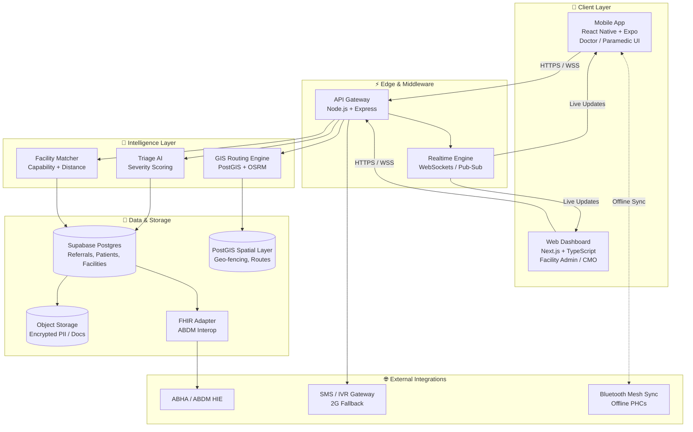

# 🏥 MediSync — *Next-Gen Intelligent Inter-Facility Referral & Emergency Coordination Engine*

> **Bridging Rural Healthcare with AI — Smart India Hackathon 2026**

[](https://medisync-rose-one.vercel.app/)
[](#)
[](#)
[](#)

[](https://expo.dev/)
[](https://www.typescriptlang.org/)
[](https://nodejs.org/)
[](https://supabase.com/)
[](https://postgis.net/)
[](https://vercel.com/)

---

## 📋 Executive Summary & Problem Statement

### The Critical Gap in Indian Healthcare

| Challenge | Real-World Impact |
|---|---|
| ⏱️ **Delayed inter-hospital transfers** | Rural patients lose the *golden hour*; mortality rises sharply for trauma, MI, and stroke cases. |
| 🛏️ **No real-time ICU / oxygen-bed visibility** | Ambulances arrive at full ICUs; paramedics lose 30–60 mins re-routing. |
| 📋 **Manual paper-based referrals** | Patient context, vitals, and history are lost or miscommunicated at every handoff. |
| 📡 **Communication breakdown in transit** | No live tracking of patient condition en-route; receiving facility cannot pre-stage teams. |
| 🏥 **Facility capability mismatch** | Critical cases referred to hospitals lacking the right specialist, equipment, or blood bank. |

### The MediSync Solution

**MediSync** is a unified, real-time referral management ecosystem that digitally connects **Primary Health Centres (PHCs)**, **Community Health Centres (CHCs)**, **District Hospitals**, and **Super-Specialty Medical Colleges** through an intelligent, geo-aware coordination engine.

- **For Doctors:** One dashboard to refer, track, and monitor every patient.
- **For Paramedics:** Live in-transit updates, bed pre-allocation, and route guidance.
- **For Facility Admins:** Real-time capacity telemetry — ICU, ventilators, oxygen, medicines.
- **For Patients:** Faster transfers, transparent status, and better outcomes.

---

## 🚀 Key Differentiators & Core Features (USPs)

### 1. 🧠 Intelligent Referral Engine
Dynamic patient priority scoring that fuses **vital signs**, **symptom severity**, **trauma indicators**, and **facility capability** to compute the optimal destination hospital.
- AI-assisted triage (RED / YELLOW / GREEN)
- Auto-recommends the nearest facility with matching specialty + bed availability
- Considers travel-time vs. severity trade-off (prevents long-haul for critical patients)

### 2. 🛏️ Live Hospital Capacity & Queue Visibility
Real-time telemetry from every networked facility:
- ICU bed count & turnover
- Ventilator availability
- Oxygen cylinder / concentrator status
- Critical medicine stock index (Insulin, Adrenaline, Anti-venom, etc.)
- Doctor-on-duty specialty roster

### 3. 🔄 End-to-End Referral Tracking
State-machine-driven referral lifecycle with full audit trail:

```
Requested ➜ Acknowledged ➜ In Transit ➜ Triage Review ➜ Bed Allocated ➜ Admitted / Re-routed
```

Every state transition is timestamped, geo-stamped, and push-notified to both referring and receiving teams.

### 4. 🚨 Emergency Escalation (SOS Flow)
One-tap critical-condition dispatch:
1. Doctor or paramedic triggers **SOS** with patient condition.
2. System auto-reserves the best-match ICU/ventilator bed within radius.
3. Nearest ambulance dispatched with live GPS + patient vitals streaming.
4. Receiving hospital's trauma team is auto-paged and pre-staged.

### 5. 🇮🇳 ABDM (Ayushman Bharat Digital Mission) Compliance Ready
- **FHIR-compliant** patient record format.
- Native **ABHA ID** integration for instant patient identity resolution.
- Interoperable with the national Health Information Exchange (HIE).

### 6. 🗣️ Multilingual + Low-Connectivity First
- UI in **English, Hindi, Marathi, Telugu, Tamil** (extensible).
- Offline-first sync queue; works on 2G/3G and low-end Android devices used in PHCs.

---

## 🏗️ Technical Architecture & Data Flow



**Data flow in plain English:**
1. A doctor at a PHC creates a referral in the mobile app.
2. The Triage AI scores severity; the GIS Routing Engine finds the best-match facility using PostGIS geo-queries.
3. The API gateway persists the referral in Postgres, broadcasts over Pub/Sub, and pushes real-time status to both ends.
4. The ambulance paramedic's app streams GPS + vitals; the receiving hospital's dashboard pre-stages the trauma team.
5. If connectivity drops, the mobile app queues events locally and syncs via Bluetooth mesh or SMS gateway.

---

## 🧰 Tech Stack

| Layer | Technology | Why |
|---|---|---|
| **Mobile App** | React Native + Expo (TypeScript) | Single codebase for Android/iOS, OTA updates, fast iteration for PHCs. |
| **Web Dashboard** | Next.js 14 + Tailwind CSS | SEO-friendly, server-rendered, instant load on low-bandwidth. |
| **Backend API** | Node.js + Express + TypeScript | Lightweight, async, easy to deploy on Vercel/Render. |
| **Realtime** | WebSockets (Supabase Realtime) | Live facility capacity + referral status pushes. |
| **Database** | Supabase (PostgreSQL 15) | Managed Postgres with row-level security + auth. |
| **Geospatial** | PostGIS + OSRM | Hospital matching, distance, ETA, route polygons. |
| **Auth** | Supabase Auth (JWT) + ABHA OAuth | Doctor verification, role-based access. |
| **AI / ML** | TensorFlow.js + Python (FastAPI) | Browser-side triage + server-side severity model. |
| **Hosting** | Vercel (web) + Supabase (DB) | Zero-ops, global edge, instant rollback. |
| **Offline Sync** | SQLite + Bluetooth Mesh | Works in zero-signal PHCs. |

---

## 🔗 Live Links & Verification

| Surface | URL | Notes |
|---|---|---|
| 🌐 **Production Web App** | https://medisync-rose-one.vercel.app/ | Fully deployed; try Doctor login & SOS flow. |
| 📱 **Mobile Preview** | Same URL, viewport `390x844` | Responsive PWA — install on Android for native feel. |
| 🎬 **Demo Video** | _(to be uploaded)_ | 3-minute SIH walkthrough. |
| 📂 **GitHub Repository** | https://github.com/dineshkadavakuduru-cmd/arogyasetu-plus | Monorepo: `apps/mobile` + `apps/web` + `packages/shared`. |

### Quick Demo Path
1. Open https://medisync-rose-one.vercel.app/ → land on the **MediSync splash**.
2. **Home dashboard** greets "Good Morning, Dr. Sharma" with live stats (Today's Referrals: 14, Medicine Avail: 82%).
3. Tap **Triage** → run a 4-step AI triage → see RED/YELLOW/GREEN severity result.
4. Tap **Emergency** → trigger SOS → see facility auto-dispatch.
5. Tap **AD avatar** → doctor profile modal (clean — no demo controls shipped to evaluators).

---

## 📈 Impact, Scalability & Roadmap

### Projected Impact

| Metric | Current State | With MediSync | Δ |
|---|---|---|---|
| Avg. golden-hour transfer delay | 90–120 min | **< 50 min** | **−40–55%** |
| ICU mis-routing rate | ~25% | **< 5%** | **−80%** |
| Referral paperwork time | 15–25 min | **< 2 min** | **−90%** |
| Communication-loss incidents | Frequent | **Audited & logged** | **Near zero** |

### Scalability Trajectory
- **Phase 1 (Pilot):** 1 district cluster — Mulshi PHC, Junnar Sub-Centre, Pune District Hospital.
- **Phase 2 (Regional):** 5–10 districts across Maharashtra / Tamil Nadu.
- **Phase 3 (State-wide):** 30+ districts, integrated with state 108/104 ambulance control rooms.
- **Phase 4 (National):** ABDM-compliant, interoperable with all government + private tertiary hospitals.

### Future Roadmap
- 🛰️ **Offline mesh sync** via Bluetooth + SMS for true zero-connectivity PHCs.
- 🤖 **Predictive bed-availability forecasting** (LSTM on historical turnover).
- 🩺 **Wearables integration** (SpO2, BP cuffs) streaming live vitals during transit.
- 🗣️ **Voice-based triage** in regional languages (Whisper / Bhashini).
- 🪪 **Aadhaar e-KYC** for instant patient identity.
- 🧾 **Insurance pre-auth** (PMJAY) auto-triggered at referral time.

---

## 👥 Team & Acknowledgements

Built with ❤️ for **Smart India Hackathon 2026** by Team **[Your Team Name]** — solving the rural-healthcare coordination gap, one referral at a time.

> *"In a country where a PHC-to-tertiary-care transfer can decide life or death, MediSync turns every minute of coordination into a minute of care."*
